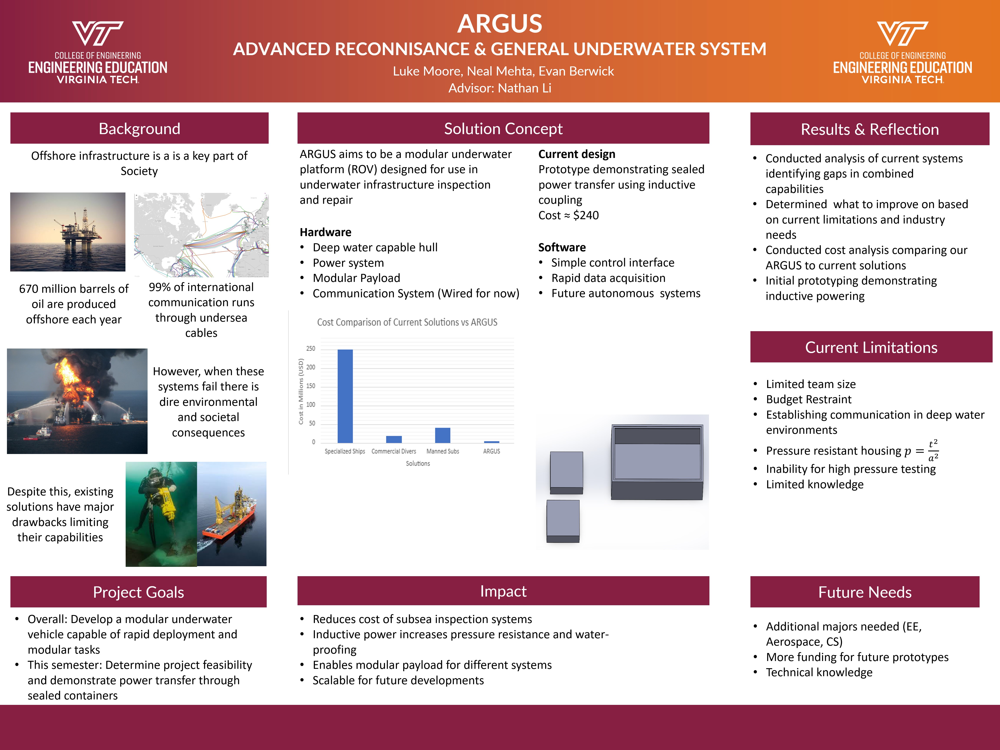
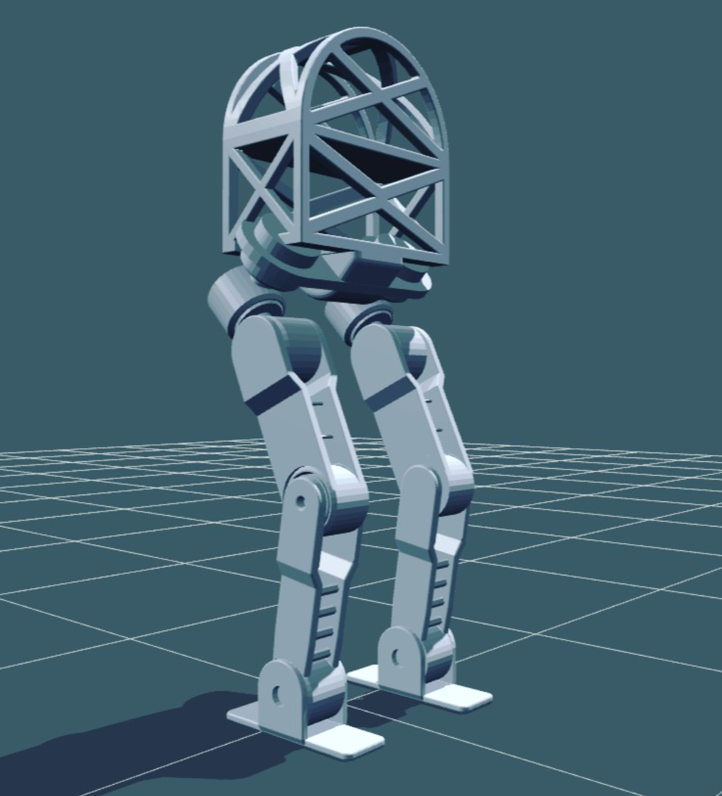
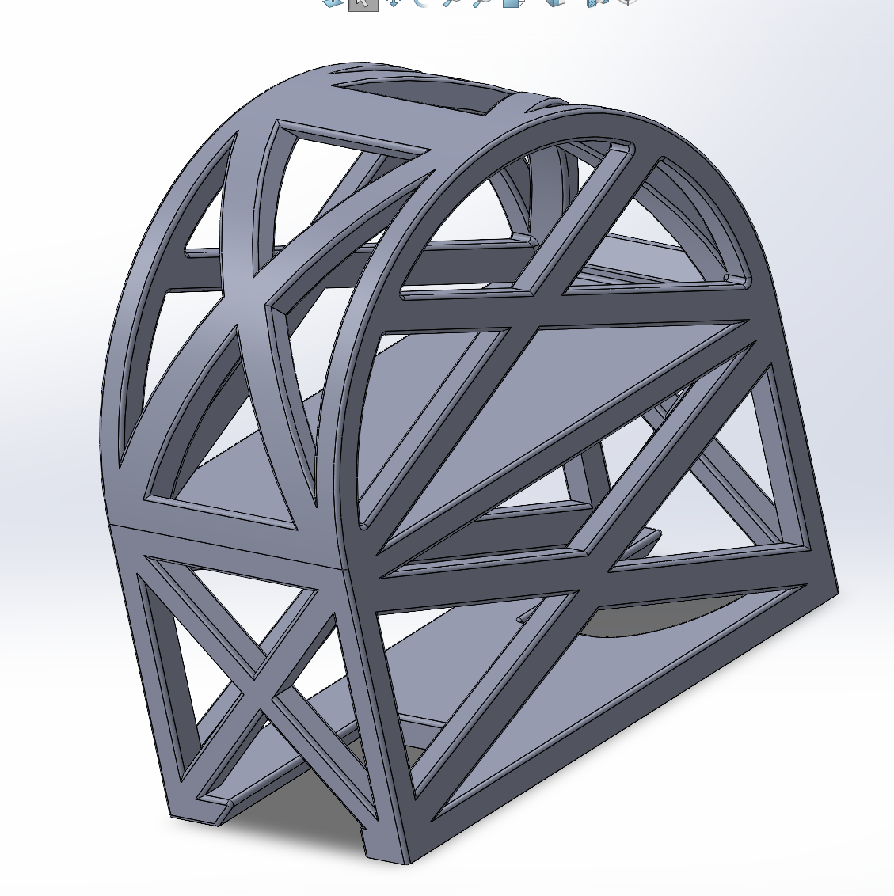
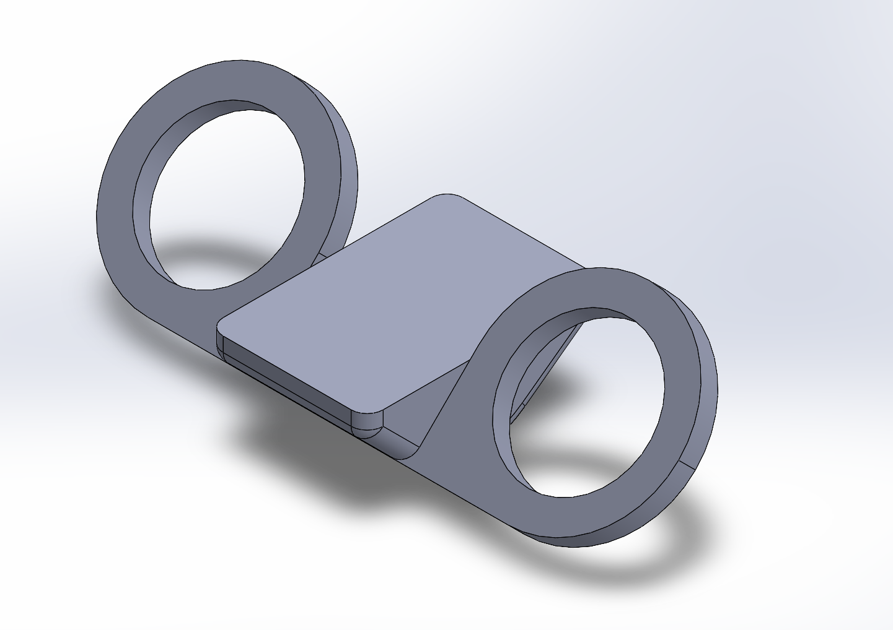
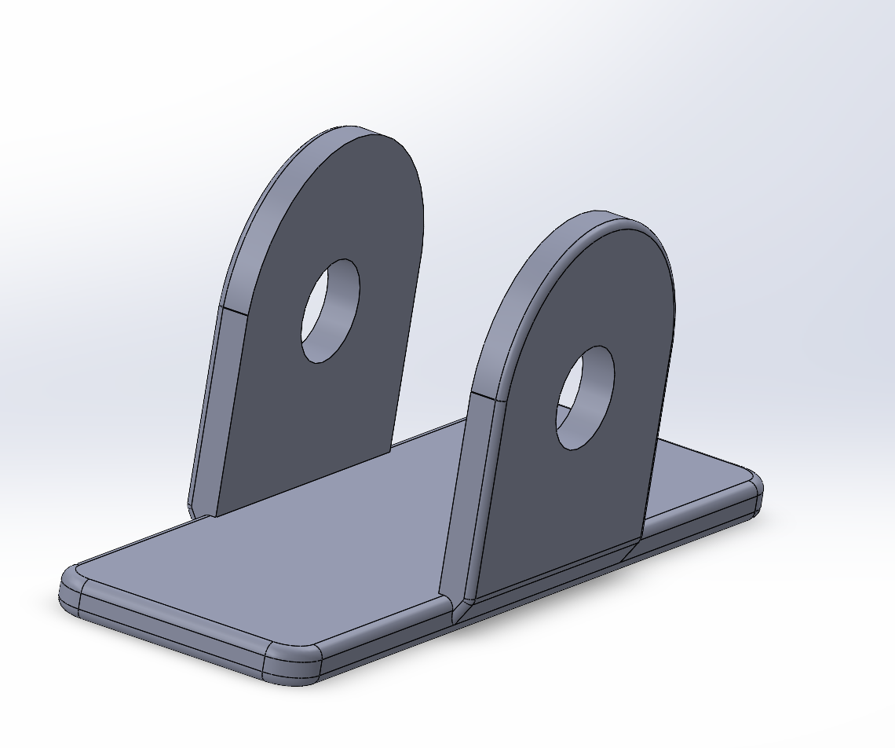
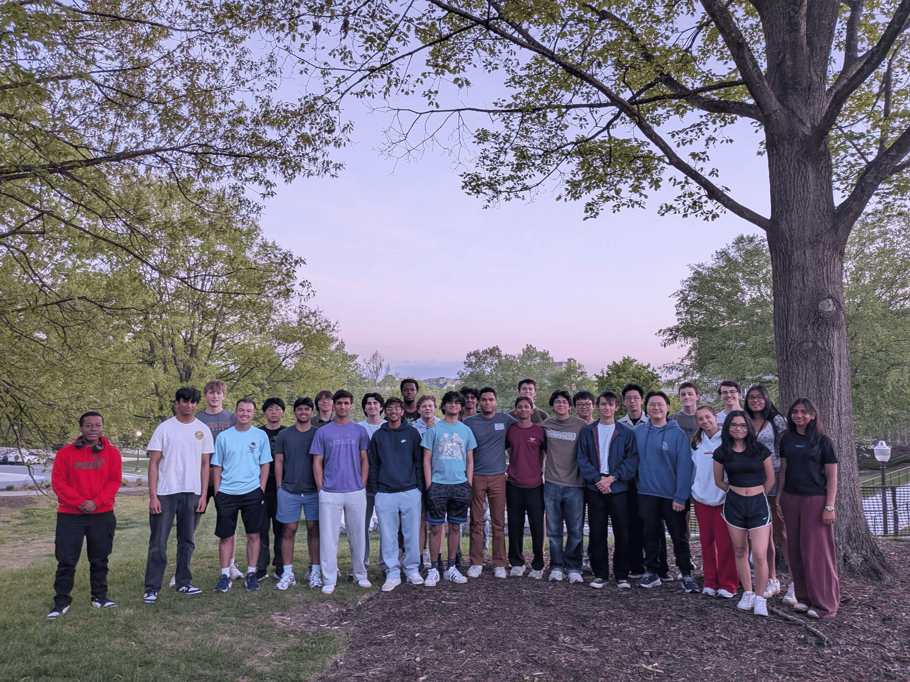
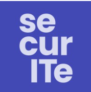

# Neal Mehta — Portfolio

> Mechanical Engineering @ Virginia Tech · CS minor · Junior
> Robotics, autonomy, hardware/software intersection. 

📫 [LinkedIn](www.linkedin.com/in/nealmehta12) · nealmehta2005@gmail.com

---

## Team & Research Projects

*Code/CAD owned by the respective teams — writeups + my contributions below.*

### ARGUS / NOMAD — Subsea Inspection ROV
**Role:** CAD Lead · **Team:** ARGUS · **Tools:** SolidWorks, Siemens NX

Designing and modeling subsystems for an underwater ROV built for subsea inspection. Currently leading CAD for the frame, pressure housing, thrusters, and buoyancy systems.

**What I did:**
- Primary CAD lead — drove frame, pressure housing, thruster mount, and buoyancy designs
- project BOM memo
- Iterating on housing + thruster mounts based on test feedback

---

### VT Humanoid Robotics — Bipedal Locomotion
**Role:** Controls Sub-team · **Tools:** NVIDIA Isaac Lab, reinforcement learning

Working on the controls sub-team for VT's humanoid robotics project. Focus is on bipedal locomotion using reinforcement learning in NVIDIA Isaac Lab.

**What I did:**
-  simulation workflows in Isaac Lab
- Testing reward function formulations and tweaking Berkley repo to match our current robot

**The robot:**

  

**Subsystem breakdown — CAD:**

<table>
  <tr>
    <td align="center"> Torso</td>
    <td align="center"> Pelvis</td>
    <td align="center"> Foot</td>
  </tr>
</table>

**The team:**

---

### SecurITe — ML/AI Security Intern (Summer 2026)
**Role:** ML/AI Security Intern · **Location:** Santa Clara, CA (Remote) · **Dates:** June–August 2026 · 🔗 [securite.world](https://securite.world/)

Working on rogue AI agent detection at a cybersecurity company focused on ML/AI security.

*Details limited due to NDA.*

---

## 🔧 Personal Builds

*Full repos on my profile — click through for BOMs, build logs, and photos.*

### 🛸 [Racing Drone](https://github.com/neal4146/racing-drone)
Custom 5" racing quad. Frame to firmware. Currently in config + flashing phase.
**Stack:** iFlight XING-E Pro 2207, SoloGood F722, ELRS, Betaflight

### 🚲 Motorized Bicycle *(repo coming soon)*
Conversion build — adding a motor to a standard bicycle.

### 🐕 SpotMicro Quadruped *(planned)*
Open-source quadruped robot build. On the to-do list.

---

## 🎓 Background

**Virginia Tech** — B.S. Mechanical Engineering, CS Minor · Expected May 2028
Transferred from Manipal Institute of Technology after one year of CS.

**Previously:**
- Data analysis + frontend dev intern @ AgeMates (healthcare nonprofit, Pune)
- Co-authored research paper on senior healthcare tech — published through the Asiatic Society of Mumbai

---

## 📫 Contact

- LinkedIn: [Neal Mehta](www.linkedin.com/in/nealmehta12)
- Email: nealmehta2005@gmail.com
- GitHub: [neal4146](https://github.com/neal4146)